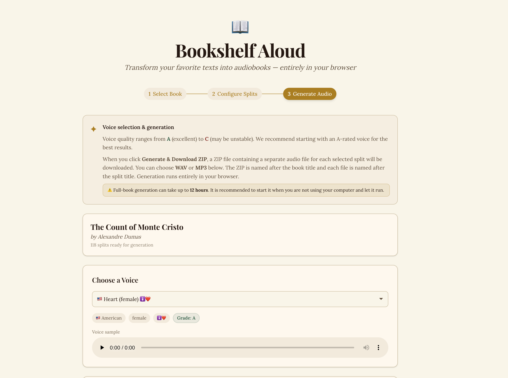

# Bookshelf Aloud

Bookshelf Aloud is a browser-based audiobook generator.

It lets you import book text, split it into chapters, choose a voice, and generate downloadable audiobook files directly in your browser using Kokoro TTS.



## Purpose

This app is designed to make long-form text (novels, public-domain books, custom `.txt` files) easy to convert into spoken audio.

The goal is to provide a practical workflow for:

- preparing clean chapter splits,
- selecting a voice,
- exporting many chapter files at once.

## Core functionality

- **Book input sources**
  - built-in library (`public/books`)
  - local `.txt` drag & drop
  - plain-text URL

- **Split configuration**
  - split by words like `Chapter`, `CHAPTER`, `Book`, `Volume`
  - custom split-word presets and manual split-word input
  - optional case-sensitive matching
  - optional first-line/title treatment
  - manual chapter editing before generation

- **Voice and generation**
  - voice list parsed from `public/voices.md`
  - in-app sample playback per voice
  - batch generation for selected splits
  - output formats: **WAV** and **MP3**
  - ZIP download containing one file per split

- **Progress and UX**
  - progress bar and live status
  - estimated remaining time during generation
  - warning that full-book generation may take up to ~12 hours

## Tech stack

- Next.js (App Router) + React + TypeScript
- `kokoro-js` for TTS
- `jszip` for packaging chapter files
- `lamejs` for MP3 encoding

## Getting started

Install dependencies:

```bash
npm install
```

Run the app:

```bash
npm run dev
```

Open [http://localhost:3000](http://localhost:3000).

## Scripts

- `npm run dev` – start local dev server
- `npm run build` – production build
- `npm run start` – run production server
- `npm run lint` – lint the codebase
- `npm run generate:voice-samples` – generate sample voice WAVs into `public/samples`
- `npm run generate:book-audio` – CLI split/audio generation pipeline (advanced/offline flow)

## Notes

- For very large books, prefer running generation when the computer is idle.
- MP3 output is much smaller; WAV preserves uncompressed audio.
